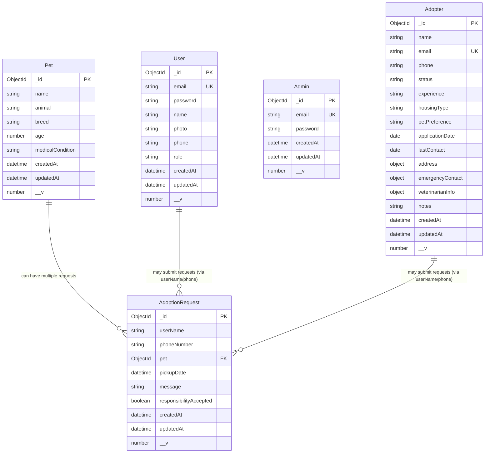

# Pet Adoption System - Entity Relationship Diagram

This ERD shows the relationships between all entities in the Pet Adoption Management System.

## Relationship Details

### Direct Foreign Key Relationships
1. **Pet → AdoptionRequest** (One-to-Many)
   - Each adoption request references a specific pet via `pet` field (ObjectId)
   - One pet can have multiple adoption requests
   - Indexed for performance: `adoptionrequests.pet`

### Soft Relationships (Business Logic)
2. **User/Adopter → AdoptionRequest** (Conceptual)
   - AdoptionRequest stores `userName` and `phoneNumber` as strings
   - These can be matched to User or Adopter records via business logic
   - No direct foreign key constraint

3. **User ↔ Adopter** (Potential Link)
   - Both have email fields that could be used to link records
   - Adopter profiles may extend User accounts
   - Implementation dependent on business requirements

### Independent Entities
4. **Admin**
   - Standalone entity for system administration
   - No direct relationships with other entities
   - Manages the system through application logic

## Key Constraints

- **Unique Constraints**: `users.email`, `admins.email`, `adopters.email`
- **Required Fields**: All entities have specific required fields as defined in schema
- **Validation Rules**: 
  - Email format validation
  - Phone number format validation
  - Pet age range (0-30 years)
  - Pickup date must be future date
  - Responsibility acceptance must be true

## Indexes for Performance

- **pets**: animal, breed, age, createdAt
- **users**: email, createdAt
- **admins**: email, createdAt
- **adoptionrequests**: pet, pickupDate, createdAt
- **adopters**: email, status, experience, applicationDate, createdAt

## Collection Sizes (Estimated)

- **pets**: 20-1000+ documents
- **users**: 100-10000+ documents
- **admins**: 1-10 documents
- **adoptionrequests**: 50-5000+ documents
- **adopters**: 50-1000+ documents